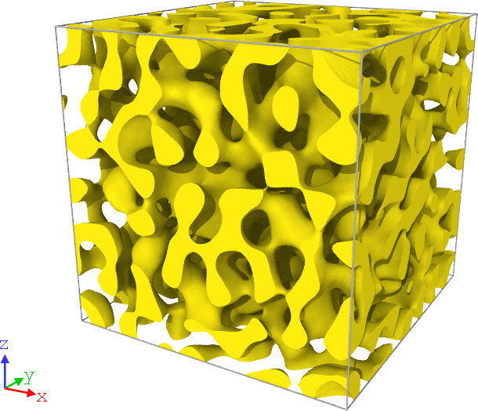

# Nanofoams_Creator
 Software para generación de muestras computacionales de estructuras estocásticas bicontinuas.. Programado en Python, apto para GPU y cluster.

 

# Próximamente

- Versión paralela del código
- Versión GPU del código

# Cómo citar este trabajo

Si Ud. utiliza este código para investigación y/o publicación de trabajos científicos, por favor citar este repositorio, de la siguiente forma: 

Este trabajo utilizó el código Nanofoams Creator, disponible libremente en https://github.com/nicolasvazquez95/Nanofoams_Creator/

Citación APA:

> Vazquez, N., & Ruestes, C. J. (2022). Software open-source para la generación de estructuras bicontinuas estocásticas. 20° CONGRESO INTERNACIONAL DE MATERIALES (SAM-CONAMET). https://github.com/nicolasvazquez95/Nanofoams_Creator/raw/main/ref/abstract_conference.pdf

O utilizar el archivo _references.bib_ del repositorio para LaTex.

# Referencias y Agradecimientos

Este trabajo es una implementación en Python por Nicolás Vazquez y Carlos J. Ruestes, basada en el artículo de Soyarslan et al

> Soyarslan, C., Bargmann, S., Pradas, M., & Weissmüller, J. (2018). 3D stochastic bicontinuous microstructures: Generation, topology and elasticity. Acta Materialia, 149, 326–340. https://doi.org/10.1016/j.actamat.2018.01.005

Funded by ANPCyT PICT-2018-0773 and European Comission Grant Agreement Project 101062254 — MeNaWir - MSCA Postdoctoral Fellowships